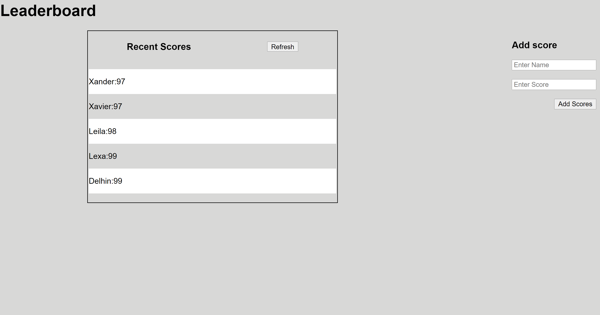

# Leaderboard

This is the first project in the APIs week at Microverse. It is a basic leaderboard with the use of custom Api from Microverse capstone Project

## Built With

- HTML5
- CSS
- Javascript
- Webpack
- npm

## Live Demo

[Live Demo Link](https://delhinrharl.github.io/Leaderboard/)

## Getting Started

To get a local copy up and running follow these simple example steps.

## Install

In your terminal, navigate to your current directory and run this code

`git clone https://github.com/DelhinRharl/Leaderboard.git`

Install npm or if installed already using this lin
`npm install`

Start the web dev server depending on your configuration

`npm start`

The Project should now be live on your browser

## Authors

👤 **Author1**

- GitHub: [@DelhinRharl](https://github.com/DelhinRharl)
- Twitter: [@tdelhinrharl](https://twitter.com/delhinrharl)
- LinkedIn: [LinkedIn](https://linkedin.com/in/AffaxedKiprotich)

## 📝 License

This project is [MIT](./MIT.md) licensed.
